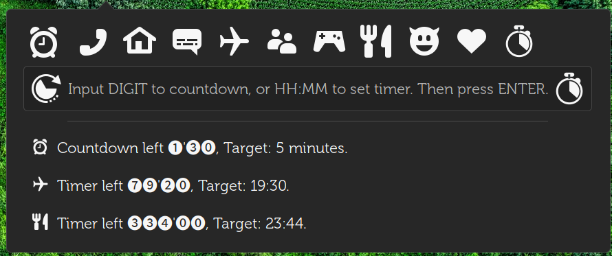

# gnome-shell-countdown-timer

[gnome-shell-extension]
[gnome-extension]
[gjs]

## Countdown & Timer

> 第一次写javascript。以前写过PAC函数。

> 吐槽：资料真少，每行都靠猜。




extensions.gnome.org 都不知道如何操作。反正传乱了。url都对不上名称。

```
⭕ tree
.
├── extension.js
├── img
│   ├── countdown-symbolic.svg
│   ├── stopwatch-symbolic.svg
│   └── timer-symbolic.svg
├── locale
│   └── zh_CN
│       └── LC_MESSAGES
│           └── countdown-timer.mo
├── metadata.json
└── stylesheet.css
```

Special thanks `andy.holmes`.